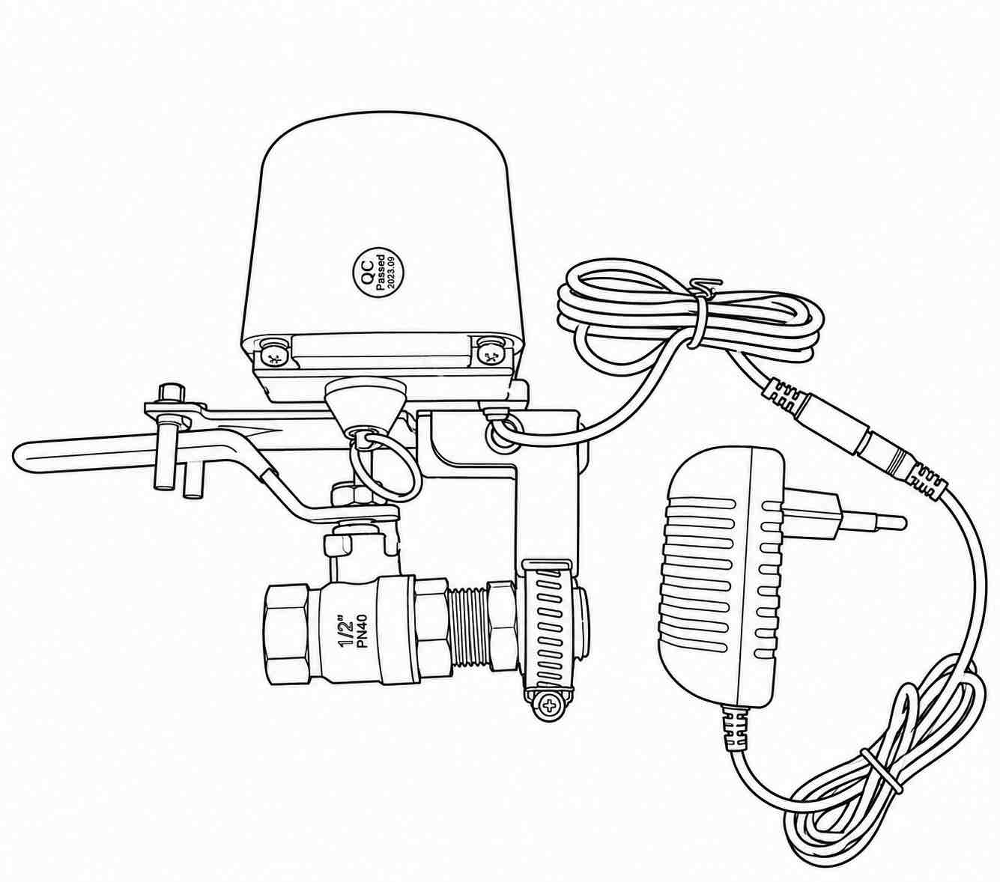
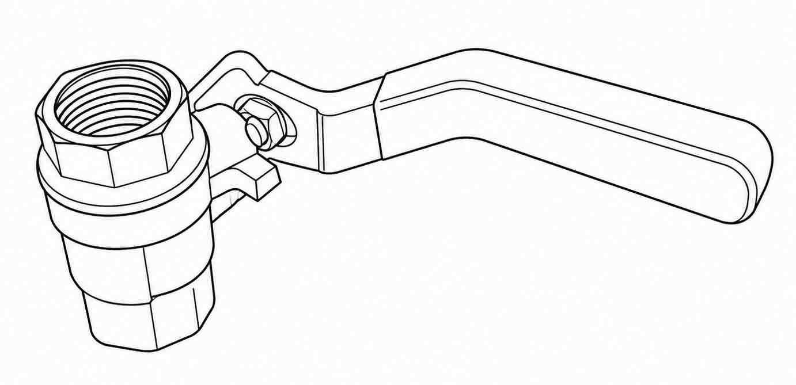
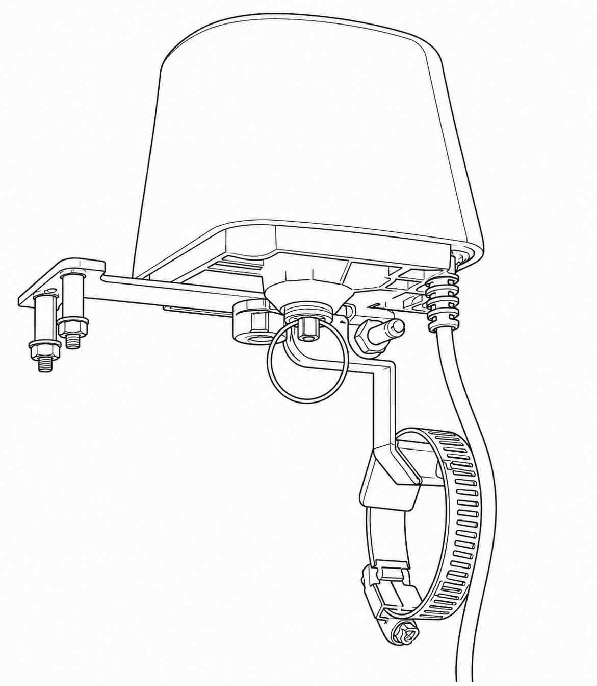
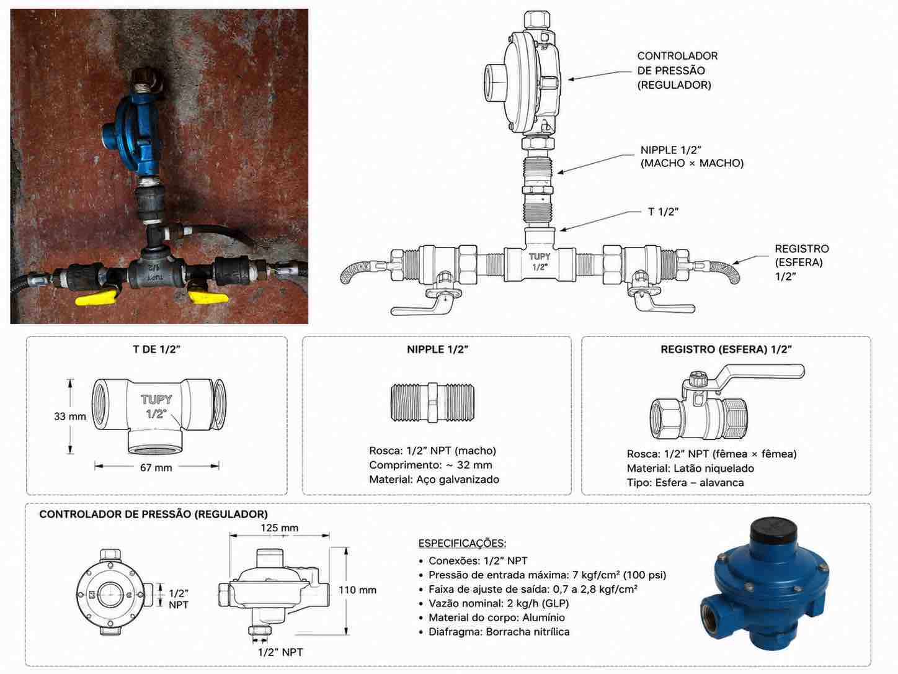
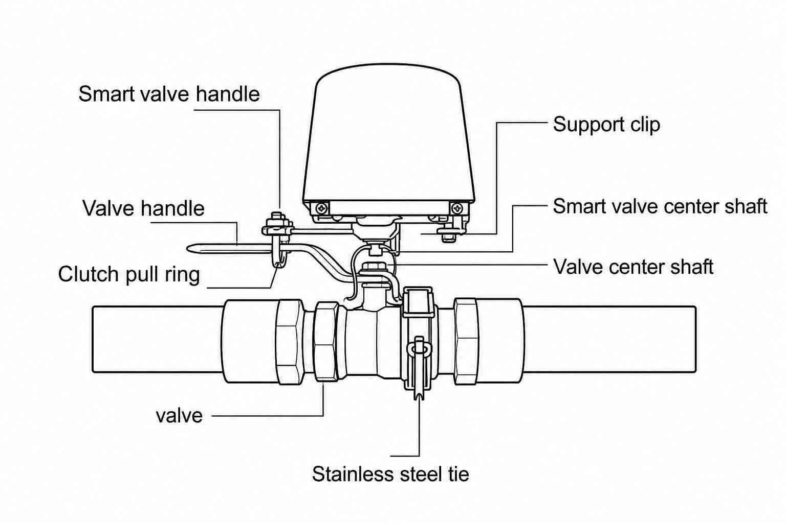
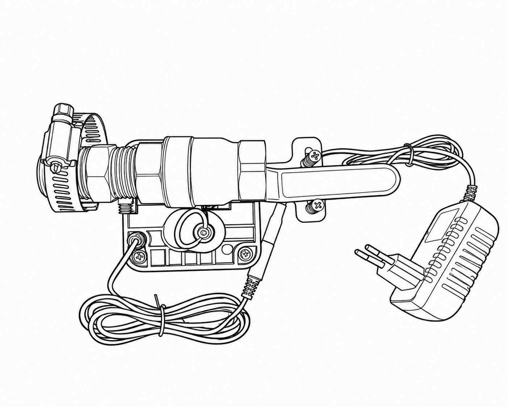

# Controlador Inteligente de Válvula Zigbee

> Manual Técnico de Instalação, Configuração e Operação

**Versão:** 1.0
**Protocolo:** Zigbee 3.0
**Compatibilidade:** Smart Life, Tuya Smart, Home Assistant, Alexa e Google Home

---

# Sumário

1. Introdução
2. Especificações Técnicas
3. Componentes do Sistema
4. Instalação
5. Configuração e Operação
6. Solução de Problemas
7. Conteúdo da Embalagem
8. Integrações Compatíveis
9. Recomendações de Segurança
10. Dados Técnicos Complementares

---

# 1. Introdução

O Controlador Inteligente de Válvula Zigbee é um dispositivo desenvolvido para automatizar a abertura e o fechamento de válvulas de esfera utilizadas em sistemas de água, gás, irrigação e automação residencial.

Utilizando comunicação Zigbee, o equipamento permite acionamento remoto, programação de horários e integração com plataformas de automação residencial.

## 1.1 Aplicações

* Segurança residencial
* Controle de fornecimento de água
* Controle de fornecimento de gás
* Sistemas de irrigação
* Automação predial
* Integração com sensores inteligentes

---

## Figura 1 – Visão Geral do Controlador Inteligente Zigbee

**Figura 1.** Controlador inteligente de válvula Zigbee utilizado para automação de válvulas de esfera em instalações hidráulicas e de gás.

---

# 2. Especificações Técnicas

| Parâmetro                 | Valor                   |
| ------------------------- | ----------------------- |
| Alimentação               | 12 VDC / 1 A            |
| Comunicação               | Zigbee                  |
| Alcance sem fio           | 30 m (área aberta)      |
| Pressão máxima da válvula | 1,6 MPa                 |
| Válvulas compatíveis      | 1/2", 3/4", 1" e 1¼"    |
| Tempo de abertura         | 5 a 10 segundos         |
| Tempo de fechamento       | 5 a 10 segundos         |
| Torque                    | 30 a 60 kgf·cm          |
| Aplicativo                | Smart Life / Tuya Smart |
| Sistema operacional       | Android / iOS           |
| Tipo de válvula           | Esfera (¼ de volta)     |

---

# 3. Componentes do Sistema

## 3.1 Registro de Esfera

**Figura 2.** Registro de esfera de ¼ de volta.

A válvula de esfera é responsável pelo bloqueio ou liberação do fluxo de água ou gás. Seu funcionamento ocorre por meio da rotação de uma esfera perfurada em 90°, permitindo abertura ou fechamento total da passagem.

---

## 3.2 Atuador Motorizado Zigbee

**Figura 3.** Atuador motorizado Zigbee para válvulas de esfera.

O atuador converte comandos enviados pelo aplicativo ou sistema de automação em movimento mecânico, acionando automaticamente a alavanca da válvula.

Principais recursos:

* Controle remoto
* Programação de horários
* Automações inteligentes
* Integração com assistentes virtuais
* Operação local e remota

---

## 3.3 Componentes da Montagem

| Nome Original            | Tradução                        |
| ------------------------ | ------------------------------- |
| Smart Valve Handle       | Alavanca da válvula inteligente |
| Support Clip             | Presilha de suporte             |
| Valve Handle             | Alavanca da válvula             |
| Smart Valve Center Shaft | Eixo central do atuador         |
| Valve Center Shaft       | Eixo central da válvula         |
| Clutch Pull Ring         | Anel de desacoplamento          |
| Valve                    | Válvula                         |
| Stainless Steel Tie      | Abraçadeira de aço inox         |

---

# 4. Instalação

## 4.1 Fixação do Suporte

**Figura 4.** Verificação do atuador e a válvula no local de instalação.

Instale um dos lados do suporte de montagem na aba de fixação do atuador.

> Não aperte completamente os parafusos nesta etapa.

---

## 4.2 Fixação na Tubulação

Fixe o outro lado do suporte de montagem na tubulação utilizando a abraçadeira fornecida.

---

## 4.3 Alinhamento dos Eixos

**Figura 4.** Alinhamento correto entre o atuador e a válvula.

O eixo do motor deve ficar perfeitamente alinhado ao eixo da válvula.

⚠️ Um desalinhamento pode provocar:

* Abertura incompleta;
* Fechamento incompleto;
* Sobrecarga mecânica;
* Queima prematura do motor.

---

## 4.4 Verificação Manual

**Figura 5.** Verificação manual da instalação.

Após a montagem:

1. Puxe o anel de desacoplamento.
2. Movimente o conjunto manualmente.
3. Verifique a livre movimentação da válvula.
4. Aperte os parafusos de fixação.

---

## 4.5 Alimentação

Conecte a fonte de alimentação fornecida:

* Entrada: 100~230 VAC
* Saída: 12 VDC / 1 A

---

# 5. Configuração e Operação

## 5.1 Instalação do Aplicativo

1. Escaneie o QR Code fornecido pelo fabricante.
2. Instale o aplicativo Smart Life.
3. Crie uma conta.
4. Faça login.

---

## 5.2 Adição do Dispositivo

1. Configure previamente um Gateway Zigbee.
2. Abra o aplicativo Smart Life.
3. Selecione o Gateway.
4. Clique em **Adicionar Dispositivo**.
5. Escolha **Dispositivo Zigbee**.
6. Pressione o botão do atuador por aproximadamente 5 segundos.

Quando o LED começar a piscar rapidamente, o dispositivo estará em modo de pareamento.

---

## 5.3 Operação Normal

### Estado padrão

Após a energização:

**Válvula Fechada**

### Indicação por LED

| Estado          | LED     |
| --------------- | ------- |
| Válvula aberta  | Aceso   |
| Válvula fechada | Apagado |

### Métodos de Controle

* Aplicativo Smart Life
* Aplicativo Tuya Smart
* Botão local
* Home Assistant
* Alexa
* Google Home

---

## 5.4 Recursos Disponíveis

* Controle remoto
* Programação de horários
* Compartilhamento entre usuários
* Cenas inteligentes
* Integrações Zigbee
* Automações condicionais

---

## 5.5 Reset do Equipamento

Para restaurar as configurações de fábrica:

1. Pressione e mantenha pressionado o botão.
2. Aguarde o LED piscar rapidamente.

O equipamento retornará ao modo de pareamento.

---

## 5.6 Operação Manual

**Figura 6.** Anel de desacoplamento para operação manual.

O anel de desacoplamento permite liberar mecanicamente o motor da válvula.

Utilize-o:

* Durante a instalação;
* Para manutenção;
* Em testes funcionais;
* Em falta de energia.

Procedimento:

1. Puxe o anel.
2. Gire manualmente a alavanca.
3. Posicione a válvula conforme necessário.

---

# 6. Solução de Problemas

## 6.1 A válvula não abre ou fecha completamente

Verifique:

* Alinhamento dos eixos;
* Fixação da alavanca;
* Ausência de travamentos mecânicos.

---

## 6.2 Válvula travada

1. Puxe o anel de desacoplamento.
2. Movimente a válvula manualmente.
3. Verifique se existe excesso de torque ou travamento.

---

## 6.3 Falha no pareamento

Verifique:

* Funcionamento do Gateway Zigbee;
* Distância entre dispositivo e Gateway;
* Qualidade do sinal Zigbee.

---

## 6.4 Outros problemas

Consulte a documentação do aplicativo Smart Life ou Tuya Smart.

---

# 7. Conteúdo da Embalagem

* 1 × Atuador inteligente Zigbee
* 1 × Fonte de alimentação 12V
* 1 × Manual do usuário
* 1 × Kit de fixação para tubulação

---

# 8. Integrações Compatíveis

O equipamento pode ser integrado com:

* Smart Life
* Tuya Smart
* Zigbee 3.0
* Home Assistant
* Zigbee2MQTT
* ZHA
* Amazon Alexa
* Google Home

---

# 9. Recomendações de Segurança

* Utilize apenas válvulas de esfera de ¼ de volta.
* Verifique o alinhamento antes da energização.
* Não exceda a pressão máxima de 1,6 MPa.
* Realize testes periódicos de funcionamento.
* Em instalações de gás, siga as normas técnicas aplicáveis.
* Não utilize o equipamento em ambientes explosivos sem certificação adequada.

---

# 10. Dados Técnicos Complementares

| Item                | Valor                            |
| ------------------- | -------------------------------- |
| Alimentação         | 12 VDC / 1 A                     |
| Comunicação         | Zigbee 3.0                       |
| Alcance             | 30 m                             |
| Torque              | 30 a 60 kgf·cm                   |
| Tempo de abertura   | 5 a 10 s                         |
| Tempo de fechamento | 5 a 10 s                         |
| Compatibilidade     | Smart Life, Tuya, Home Assistant |
| Tipo de válvula     | Esfera ¼ de volta                |

---

## Licença

Este documento pode ser utilizado livremente para fins de instalação, manutenção e integração do Controlador Inteligente de Válvula Zigbee.
